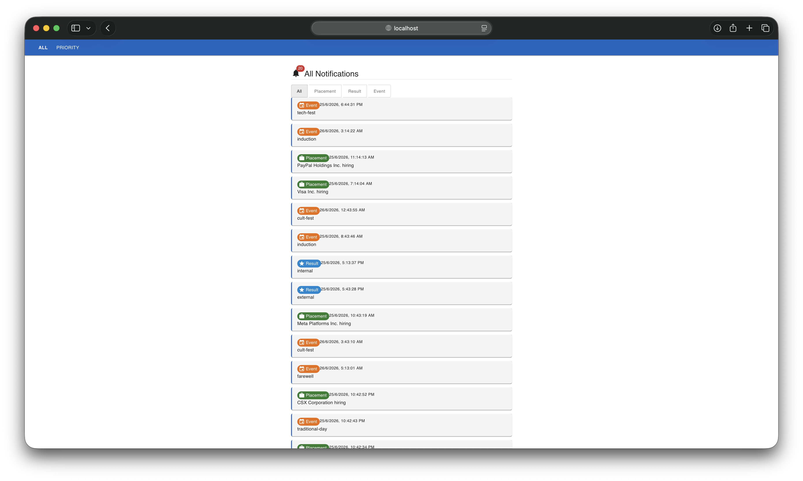
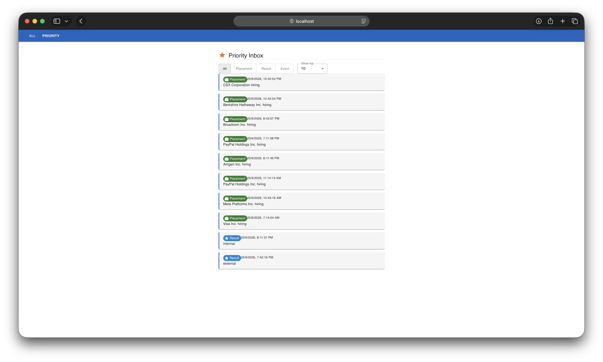

# Notification System

This is the campus notification system I built for the evaluation. Backend is Node and frontend is React. The idea is to sort notifications by priority (using a min-heap) so users actually see the important stuff first instead of getting buried under 100 event notifications.

## System Overview

### Stage 1: Priority Algorithm & Backend
To handle sorting notifications efficiently as they stream in, I implemented a min-heap logic rather than doing a full sort every time.
- **Priority Logic**: 
  - `Placement` weight: 3
  - `Result` weight: 2
  - `Event` weight: 1
  - Ties are broken by recency (newer timestamp wins).
- **Complexity**: Inserting into a fixed-size heap of size N (here N=10) is O(log N) which is basically constant. For M incoming items, total time is O(M log N) instead of re-sorting everything each time.

Code is in `priority-notifications.js`.

### Stage 2: React Frontend App
Took over the frontend scaffold, fixed a bunch of bugs and missing pieces:
- `/` shows all notifications with a type filter
- `/priority` shows the top N priority inbox (5, 10, 15, or 20)
- Read/unread tracking using localStorage
- Fixed an infinite re-render loop in the notifications hook

---

## Visuals & Demos

### Video Demos

#### Desktop View
<video src="media/desktop.mp4" width="100%" controls></video>

#### Mobile View
<video src="media/mobile.mp4" width="100%" controls></video>

### Screenshots

#### All Notifications Page

#### Priority Inbox Page

